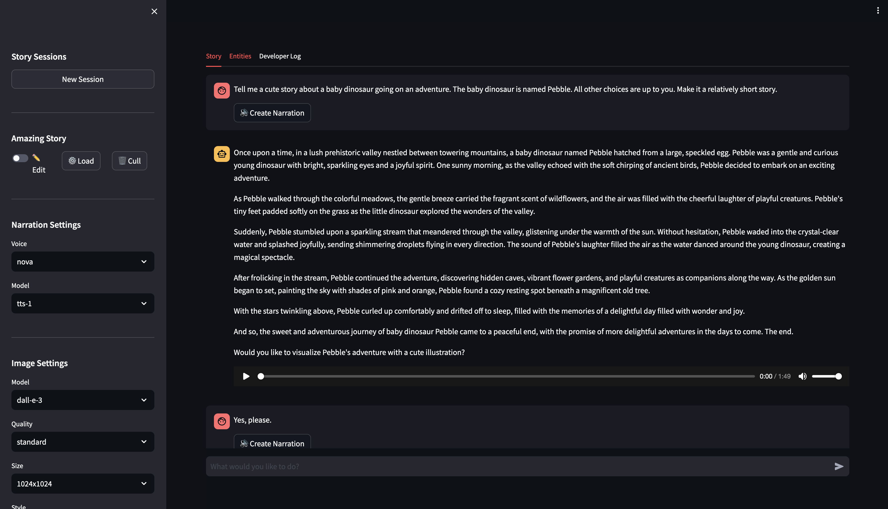
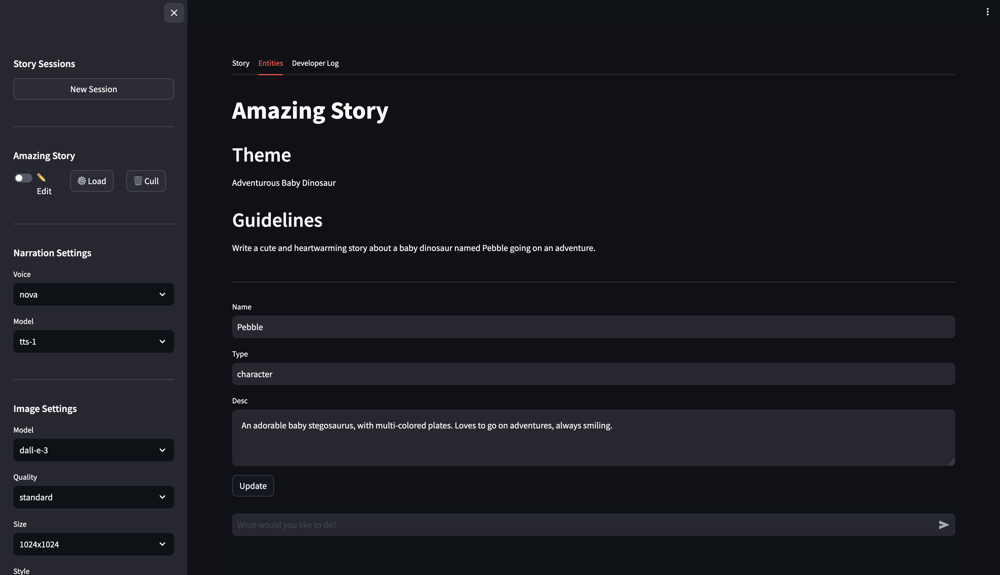

# OpenAI Storyteller

This application demonstrates how to use the OpenAI Assistants API. The application is an interactive story creation tool. The intended use is as a choose your own adventure story creation tool. However, it's flexible enough to be used in other ways.

The application tracks the state of the story by capturing the theme, general story guidelines, and entities that appear in the story, such as: characters, items, and locations. The application ties into the OpenAI image and audio generation APIs to provide a more immersive experience. 

The user interface consists of a sidebar and a main view. The sidebar contains functionality for creating, loading, and removing story sessions. It also contains functionality for configuring the assistant and audio/image generation. The main view contains a chat input used to send messages to the assistant. Messages are displayed on the story tab of the main view. 



Entities extracted from the story are displayed on the entities tab. The assistant uses the description of the entities to provide more context for the story, and to generate images.




### Requirements

- Python 3.11+
- OpenAI API key


### Setup

1. Clone the repository.
    ```bash
    git clone "https://github.com/cloudacademy/openai_storyteller.git"

2. Change directory to the root of the project.
    ```bash
    cd openai_storyteller
    ```
    
3. Create a new virtual environment.
    ```bash
    python -m venv .venv
    ```

4. Activate the virtual environment.
    ```bash
    source .venv/bin/activate
    ```

5. Change directory to the root of the project.
    ```bash
    cd stories
    ```

6. Install the dependencies.
    ```bash
    pip install -r requirements.txt
    ```

7. Create a `.env` file in the root of the project and add the following environment variables.
    ```bash
    echo "OPENAI_API_KEY=<your-openai-api-key>" > .env
    ```

8. Add the current module to the Python path.
    ```bash
    export PYTHONPATH=$PYTHONPATH:$(pwd)/src
    ```

9. Start the UI.
    ```bash
    streamlit run src/stories/ui.py
    ```

10. Open the URL listed in the console.


